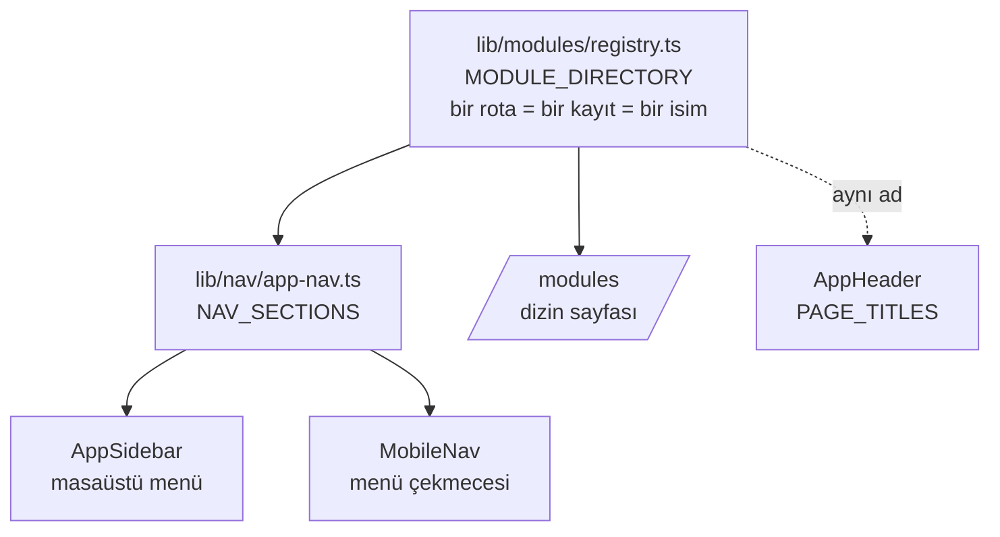

# Sistem Mimarisi — Lospia / AF Operasyon

Bu doküman sistemin **nasıl kurulduğunu** anlatır: hangi katman neyi yapar, bir
istek nereden nereye gider, veri nerede durur, ekran dili hangi kurallara
uyar. Ürün kararlarının *gerekçeleri* kodun içindeki yorumlarda ve
`CLAUDE.md`'de yaşar; burası yapının haritasıdır.

Son güncelleme: 2026-08-30.

---

## 1. Sistem nedir

Tek bir Next.js dağıtımı, iki kimlikle çalışır:

| Katman | Nedir | Nerede görünür |
|---|---|---|
| **Lospia** | Ürünün kendisi — çok kiracılı operasyon platformu | Pazarlama sitesi + platform hostları |
| **AF Operasyon** | Aslı Filinta ekibinin pilot çalışma alanı (kiracı) | `operasyon.aslifilinta.com` |

Marka seçimi **host'tan** türer (`lib/branding.ts` → `getAppBrandForHost`).
Çalışma alanı **adı** ise kullanıcı verisidir ve marka varlıklarıyla asla yer
değiştirmez. Pazarlama sitesi host kapılıdır: AF host'u onu hiç sunmaz
(`lib/marketing/host.ts`).

**Tasarım hedefi:** sistemi mühendis olmayan bir ekip (tasarımcı, üretim,
ofis) günlük olarak kullanıyor. Bu yüzden mimarinin iki ölçütü var — *bir
ekran tek isimle yaşar* ve *kabuk her gezinmede hızlı açılır*.

---

## 2. Teknoloji yığını

| Alan | Seçim | Not |
|---|---|---|
| Çatı | **Next.js 16** (App Router, RSC) | `middleware` → **`proxy.ts`** olarak yeniden adlandırıldı |
| Dil | TypeScript (strict) | `npm run typecheck` CI kapısı |
| Stil | **Tailwind v4** (`@theme inline`) | Token'lar `app/globals.css`'te tek yerde |
| Veri | **Supabase** (Postgres + Auth + Storage) | `@supabase/ssr`, local-first geliştirme |
| Yetki | **Row Level Security** — 47/47 tabloda açık | Uygulama okumaları RLS'i asla atlamaz |
| Etkileşim | `dnd-kit` (Kanban + takvim), `@tanstack/react-table` (liste) | |
| Yardımcılar | `date-fns`, `zod`, `fractional-indexing`, `lucide-react`, `exceljs` | |
| Dış bağımlılık | **Yok** (yedekleme, ZIP, animasyon, sanitizasyon kendi kodumuz) | Maliyet ve devamlılık kararı |

---

## 3. İstek yaşam döngüsü

```mermaid
flowchart LR
  R[İstek] --> P[proxy.ts<br/>updateSession]
  P -->|oturum yok| L[/login/]
  P -->|marketing host| M[(marketing)]
  P -->|oturum var| S[app/(app)/layout.tsx<br/>KABUK]
  S --> H[AppHeader + AppSidebar + MobileNav]
  S --> C[Sayfa RSC<br/>kendi verisini kendi çeker]
  C --> A[Server Action<br/>lib/actions/*]
  A --> DB[(Supabase · RLS)]
  A --> N[notifyTaskEvent]
  N --> DB
```

**Oturum doğrulaması `getClaims()` ile yapılır, `getUser()` ile değil.**
`getUser()` her istekte Auth sunucusuna gerçek bir HTTP turu atıyordu ve proxy
*tüm* isteklerde çalıştığı için (gezinme, RSC prefetch, server action) bu tur
her tıklamaya biniyordu. `getClaims()` JWT'yi yerelde doğrular.

**Kabuk en fazla iki tur atar.** `app/(app)/layout.tsx` her gezinmede
çalışır; oraya eklenen her sorgu *tüm* sayfaları yavaşlatır. Bugünkü hâli:
üyelik + bildirimler + profil **aynı dalgada**, ardından yalnız gerekirse tek
bağımlı sorgu. **Kurala dokunma: kabuğa yeni sorgu eklenmez.**

---

## 4. Katmanlar

```
proxy.ts ─────────── oturum kapısı (Next 16: middleware'in yeni adı)
app/
  (auth)/ ────────── giriş
  (marketing)/ ───── Lospia genel sitesi (host kapılı)
  (app)/ ─────────── uygulama kabuğu + korumalı rotalar
    @modal/ ──────── paralel yuva: görev çekmecesi (intercepting route)
  api/ ───────────── route handler: yedek · çıkış · gelen e-posta
components/ ──────── alan başına klasör + ui/ = paylaşılan primitifler
lib/
  supabase/ ──────── browser | server | middleware istemcileri
  actions/ ───────── TÜM mutasyonlar (29 dosya, "use server")
  <alan>/ ────────── saf alan mantığı: planning, collection, production,
                     points, notifications, backup, nav, office, crm…
  auth/permissions.ts  rol → yetki fonksiyonları (tek kaynak)
modules/ ─────────── feature-flag'li entegrasyonlar (uploads/slack/email/ai/realtime)
supabase/migrations/  93 SQL dosyası — şemanın tek kaynağı
types/ ───────────── database.ts (üretilmiş) + index.ts (uygulama tipleri)
```

### Değişmez kurallar

| Kural | Neden |
|---|---|
| Mutasyonlar **yalnız** `lib/actions/*` içinde | Yetki + doğrulama + günlük tek yerde |
| Bildirim **yalnız** `notifyTaskEvent` üzerinden | Doğrudan insert tekilleştirmeyi atlar |
| Kabuğa (`layout.tsx`) sorgu eklenmez | Her gezinmede çalışır |
| Migration **idempotent** + açık GRANT | Prod'a elle uygulanır, tekrar çalışabilmeli |
| Pop-up = `components/ui/Overlay` | Elle `fixed inset-0` transform'lu atada bozuluyor |
| Form alanı = `components/ui/Field` | Kontrol eşitliği (aynı yükseklik, tek ok) |
| Giriş ekranı = `components/ui/TileGrid` | Tek tasarım dili |
| Kart içinde `<a>` yuvalama yok | Hydration hatası → sayfa donuyordu |

---

## 5. Bilgi mimarisi (IA)

Sistemin en pahalı hatası "aynı ekranın farklı isimlerle birden çok yerde
görünmesi" olmuştu. Çözüm **tek kaynak zinciri**:



**Üç sabit bölüm** (menü, çekmece ve hub'da birebir aynı adlarla):

| Bölüm | İçerik | Kim görür |
|---|---|---|
| **Core Operations** | Home Page · Calendar · Board · **List** | herkes |
| **Product & Office** | Collection · AF Teamwork · CRM | herkes |
| **Admin** | Admin Board · Finance · Settings | yalnız owner/admin (üyede bölüm hiç çizilmez) |

- **Operation Modules** hiçbir bölüme girmez: o bir modül değil, modüllerin
  *dizini*. Menünün altında, kendi ayracıyla durur.
- **Menü sık kullanılanı taşır, hub hepsini listeler.** List, Cost, Payment
  Table, Product Data, Activity Log, Archive, Trash yalnız hub'da.
- **Mobil**: alt gezinme dört sekme + **Menu** → soldan açılan tam menü
  çekmecesi (aynı bölümler + Profilim/Çıkış). Telefonda erişilemeyen ekran
  bırakılmaz.
- **Giriş rotası `/home`** — tüm roller. İçerik "bugün ne yapacağım?": işler
  zamana göre gruplu (Gecikmiş · Bugün · Bu hafta · Sonrası · Tarihsiz) +
  toplantılar. Kısayol ızgarası **yok** (menü zaten yanda).

---

## 6. Veri modeli

**47 tablo**, hepsinde RLS açık ve en az bir politika tanımlı (doğrulandı).
Neredeyse tamamı `workspace_id` taşır; kiracı sınırı budur.

| Alan | Tablolar |
|---|---|
| **Çekirdek** | `workspaces` · `workspace_members` · `profiles` · `workspace_departments` · `department_members` · `workspace_invites` |
| **Görev** | `tasks` · `task_notes` · `task_note_acknowledgements` · `task_activity` · `task_activity_logs` · `task_attachments` · `task_member_completions` · `time_entries` · `custom_field_definitions` · `saved_views` |
| **Planlama** | `planning_meetings` · `planning_topics` · `planning_bands` · `planning_templates` · `planning_week_matrix` · `planning_open_items` · `planning_process_steps` |
| **Ürün / üretim** | `production_sheets` · `production_sheet_materials` · `workspace_seasons` · `workspace_manufacturers` · `workspace_materials` · `workspace_suppliers` · `workspace_product_categories` |
| **AF Teamwork** | `document_folders` · `operation_documents` · `operation_spreadsheets` (+`_versions`) · `document_templates` (+`_versions`) · `creative_assets` |
| **İlişkiler / para** | `workspace_contacts` · `finance_payments` |
| **Sistem** | `notifications` · `points_ledger` · `workspace_notes` · `workspace_rules` · `workspace_activity_logs` · `workspace_backups` · `webhook_events` · `request_access_leads` |

**Depolama kovaları:** `documents` (özel, 25 MB) · `production-sheets` ·
`teamwork-images` (5 MB) · `task-attachments` · `avatars`.

### Erişim modeli

> **"Herkes görür, yönetici müdahale eder."**

| Rol | Yapabildikleri |
|---|---|
| `owner` | Her şey + üye yönetimi + çalışma alanını yeniden adlandırma |
| `admin` | Yönetim yüzeyleri, onay, silme, ayarlar, finans |
| `member` | Görev oluşturma; kendi/atandığı işlerde düzenleme; takvimi okur. **AF Teamwork'te kendi eklediği yazı/tablo/dosyayı siler, kendi klasörünü açar ve yönetir** (20240334) |
| `viewer` | Salt okur |

- **Görev "done" iki yönde de yöneticiye aittir**: üye işi "Kontrol/Onay"a
  gönderir, yönetici tamamlar.
- **Sorumluluk** = katılımcılar ∪ atanan (`lib/people/assignable.ts`,
  `canManageTaskAssignment`). Üye kendini bir işe *ekleyemez* — bu, "kendimi
  atayıp düzenleme hakkı kazanma" açığıydı.
- **AF Teamwork'te SAHİPLİK** (20240334): yönetici her kaydı, üye YALNIZ KENDİ
  oluşturduğunu yönetir — kendi yazısını/tablosunu/dosyasını siler, kendi
  klasörünü açar, adlandırır, siler. `visibility` (`'all' | 'admin'`,
  varsayılan `'all'`) artık klasörün yanı sıra `operation_documents` ve
  `operation_spreadsheets`'te de var: "tüm üyelere göster" dört varlıkta aynı
  cümle. UI karşılığı `DriveBrowser.canManage()`.
  *Yüklenen dosya ayrı tablo değildir — `operation_documents` satırıdır
  (`document_type='file'`).*
- **Veri düzeyinde kapalı** (RLS ile, yalnız yönetici): Finans, Aktivite,
  Arşiv, Çöp, Ayarlar, Yedekleme.
- **Maliyet ekibe açıktır** (föy fiyatları + Maliyet Tablosu) — Excel'de de
  öyleydi. Yalnız `finance_payments` yönetici-only.

### Kimlik / katılım akışı

Kayıt yok, **erişim daveti** var: yönetici Ayarlar'dan e-posta tanımlar; kişi
giriş yaptığında `accept_workspace_access_grant()` RPC'si daveti tüketip
üyeliği açar. Davetsiz e-posta temiz bir "erişim yok" ekranı görür.
*(`provision_workspace` kullanılmaz — rastgele kişisel çalışma alanı açıyordu.)*

### Migration disiplini

93 dosya, `supabase/migrations/`. Her biri **idempotent** (`if not exists` /
`drop … if exists` + `create`) ve yeni tabloya **açık GRANT** verir
(`authenticated`, `service_role`). **Prod'a push'u kullanıcı elle çalıştırır.**

---

## 7. Tasarım sistemi

### Token'lar (`app/globals.css`, `@theme inline`)

| Grup | Değerler |
|---|---|
| Zemin | `--app-bg #f3f6f7` · `--surface #fff` · `--surface-muted` · `--surface-sunken` |
| Çizgi | `--hairline #e7edee` · `--border #d5dee0` · `--border-strong` |
| Metin | `--text #121a1e` · `--text-muted #44525a` · `--text-subtle #72828a` |
| Marka | `--brand #2a6b7a` · `--brand-strong` · `--brand-soft` · `--brand-ring` |
| Durum | danger · warning · hold · approval · success · info · overdue · urgent |
| Yarıçap | kart `10px` · kontrol `8px` · modal `16px` |
| Gölge | `card` · `card-hover` · `pop` · `drawer` |
| Süre | fast `120ms` · normal `180ms` · slow `280ms` |
| Eğri | `standard cubic-bezier(.2,0,0,1)` · `emphasized cubic-bezier(.32,.72,0,1)` |

### Tipografi — **dokunulmaz blok**

Gövde **450**, `letter-spacing: 0`, `-webkit-font-smoothing` **yok**
(macOS'ta bulanıklaştırıyor), `optimizeLegibility` **yok**. Ağırlıklar:
medium 560 · semibold 640 · bold 740. Boyut tabanı: birincil metin **≥13.5px**,
meta ≥12px; 10–11px gri minik yazı yok. Hizalı rakam gereken yerde
`tabular-nums`.

### Primitifler

| Primitif | İşi |
|---|---|
| `ui/TileGrid` (`Tile`) | **Tek giriş deseni.** Referansı Pano kişi kartı; Koleksiyon, AF Teamwork, Library aynı kartı kullanır |
| `ui/Overlay` | **Tüm** pop-up'ların gövdesi: portal + Esc + kaydırma kilidi + mobil yaprak |
| `ui/Field` | `Field`/`TextInput`/`SelectInput`/`TextArea`, ortak `h-9`; select oku globals'ta bir kez |
| `ui/Button` | primary · secondary · ghost · destructive; sm/md |
| `ui/useConfirm` | Tek onay kapısı — `window.confirm()` kullanılmaz |
| `modules/ModulePageHeader` | Tek satır: ← Geri + aksiyonlar (başlık zaten AppHeader'da) |
| `modules/BackLink` | **Hiyerarşik** geri (`lib/nav/parent-path.ts`) — `router.back()` denendi, geri alındı |

### Hareket

`anim-fade` · `fade-up` · `fade-down` · `scale-in` · `drawer-in` (sağ) ·
`drawer-left` (mobil menü) · `slide-up` (mobil yaprak) · `shimmer` ·
`stagger-children`. Hepsi CSS; hareket için paket eklenmez.

### Düzen kuralları

- **Tam genişlik**: `w-full px-4 sm:px-6 lg:px-8`, `max-w` kapağı **yok**.
  Izgaralar 2xl'de 5–6 sütuna açılır (Jira/ClickUp yoğunluğu).
- Renkli sol kenar `cn()` **dışında** verilir — tailwind-merge border renklerini
  yutuyor.
- Katman sırası: `z-50` portal · `z-40` kabuk · `z-20` sayfa yapışkanları ·
  `z-10` kart içi.
- Sayfa **adları İngilizce**, içerik **Türkçe**.

### İki içerik kuralı

**Sadelik kuralı — "İsmi, işi, tarihi bu kadar."**
Bir sayı/etiket eklemeden önce test: *bir kişiyi veya işi PUANLIYOR mu?*
(4 görev, 3 gecikti, N puan) → **ekleme**. *Baktığın listeyi TARİF mi ediyor?*
(kategoride 12 ürün, "son yedek 8 gün önce") → serbest. Kart başına en fazla
bir rozet.

**Tek tasarım dili.** Yeni bir liste/ağaç/açılır-kutu düzeni icat edilmez;
giriş ekranı `TileGrid`'dir. Süzgeç kalıbı: **başlık · tür · departman**.

---

## 8. Alan modülleri

| Modül | Rota | Çekirdeği |
|---|---|---|
| **Ana Sayfa** | `/home` | Zamana göre gruplu işler + toplantılar; admin'e yedek hatırlatması |
| **Calendar** | `/planning` | Tek takvim (hafta/ay/yıl), sürükle-bırak, şeritler düzenlenebilir. Kayıtlı saat **New York**'tur, İstanbul hesaplanır (`lib/planning/timezones.ts`). Yazım admin-only |
| **Board / Admin Board** | `/board`, `/admin-board` | Kişi kartlarından girilen Kanban; hafta süzgeci `due_date`-only |
| **Collection** | `/collection` (+ `maliyet`, `odeme`, `veri`) | Üretim föyü = merkez ürün kaydı; düzenlenebilir **üç kademeli** kategori taksonomisi (Accessories › Hats › Bucket Hat). Föy iki alan taşır (`category` + `subcategory`); anahtarlar çalışma alanında tekil olduğu için `subcategory` üçüncü seviyeyi de tutar, yol `subPath()` ile çözülür |
| **Production** | `/production/[id]` | Föy editörü + XLSX/yazdırma; üreticiye **mail** gider, sisteme erişim verilmez |
| **AF Teamwork** | `/documents` (+ `sheets`, `library`) | Klasör · yazı · tablo · dosya · dış bağlantı. Word benzeri editör, gövde sunucuda `sanitize-html` ile temizlenir |
| **CRM** | `/crm` | Kişi rehberi + yedi adımlı influencer seeding |
| **Finance** | `/finance` | Ödeme takibi, admin-only (RLS dahil) |
| **Reports** | `/dashboard` | Departman/durum özetleri, kişi raporu. **List yüzeyinin son SEKMESİ** (`components/shared/SurfaceTabs`): menüde kendi satırı yoktur, `/list` ile aynı şeridi paylaşır. Rotalar ayrı kalır — rapor sorguları liste açılışına binmesin |
| **Settings** | `/settings` | Ekip · Hesabım · **Yedekleme** |

---

## 9. Çapraz kesen sistemler

### Bildirim
Tek kapı: `notifyTaskEvent`. Başlığı çözer, aktörü ve tekrarları düşürür,
insert'i **SECURITY DEFINER** RPC'ye verir (`create_task_notifications`) —
uygulama katmanı başkasının satırlarını okuyamadığı için tekilleştirme ancak
definer içinde çalışır. Pencere 5 dk. E-posta yalnız iki olayda:
`task_assigned`, `task_responsibility_added`.

### Günlük (audit)
`task_activity_logs` göreve bağlı olaylar için; `workspace_activity_logs`
göreve bağlı **olmayanlar** için (indirme, silme). İkisi de değiştirilemez.

### Yedekleme
`/api/backup` (admin-only, Node runtime, akış hâlinde ZIP):

```
OKUBENI.txt · ozet.json · veri/<tablo>.json · tablo/<tablo>.csv · dosyalar/<kova>/<yol>
```

`?files=1` depolamayı da katar (bütçe 1.5 GB — ZIP64 yazılmıyor). ZIP yazıcısı
kendi kodumuz (`lib/backup/zip.ts`: deflate + CRC32, bağımlılıksız). Kapsam
`lib/backup/collect.ts`'te; **yeni tablo eklenince o listeye de eklenmeli.**
Okuma RLS ile yapılır (service role kullanılmaz). Her indirme
`workspace_backups`'a yazılır; Ayarlar ve Ana Sayfa 7 günden eski yedeği
hatırlatır.

### Feature flag'ler
Hepsi varsayılan `false`, `.env.local`'den:
`UPLOADS` · `SLACK` · `EMAIL_TO_TASK` · `AI` · `REALTIME`.
Kodları `modules/` altında izole; kapalıyken uygulama onlara hiç dokunmaz.
Gerçek e-posta için ayrıca `EMAIL_NOTIFICATIONS_ENABLED=true` şart.

### Canlılık
`WorkspaceLiveRefresh` 60 sn'de bir tazeler. Daha sık gerekiyorsa aralığı
düşürmek yerine `REALTIME_ENABLED` açılır (15 sn'lik tam sayfa yenilemesi
"site donuyor" şikâyetinin kaynağıydı).

---

## 10. Güvenlik

| Konu | Kural |
|---|---|
| RLS | 47/47 tabloda açık, hepsinde politika var; uygulama okumaları RLS'i atlamaz |
| Service role | Tarayıcıya **asla** sızmaz; yalnız sunucu tarafı bakım işleri |
| XSS | AF Teamwork gövdesi **yazarken** `lib/office/sanitize-html.ts` ile temizlenir (allowlist; `style` içinden yalnız renk, `img[src]` yalnız http(s)); okuma anında ikinci temizlik yok — depolanmış XSS'i engelleyen tek katman budur |
| Gömülü görsel | Public `teamwork-images` kovasında (özel kovanın imzalı URL'i 60 sn'de sönüyor, gömülü `` ertesi gün kırılıyordu). Hassas belge yazıya gömülmez, dosya olarak yüklenir |
| Sır yönetimi | `.env.local` gitignore; gerçek sır commit edilmez |
| Silme | Her yıkıcı işlem `useConfirm` ile sorar ve günlüğe yazılır |

---

## 11. Geliştirme ve dağıtım

```bash
npm run dev / build / typecheck / lint

supabase start                 # Docker gerekir
supabase db reset              # migration + seed (LOCAL veriyi siler)
supabase status                # .env.local için URL + anahtarlar
supabase gen types typescript --local > types/database.ts
```

- **Vercel bölgesi `arn1`** (Stockholm) — Supabase projesiyle aynı yerde;
  bölge farkı her Supabase turuna gecikme ekliyordu.
- Seed hesapları: `alice`(owner) · `bob`(admin) · `nisa`(member) ·
  `viewer` — `@taskos.local`.
- Git remote **SSH**'tir.

---

## 12. Bilinen açıklar / bekleyenler

| Konu | Durum |
|---|---|
| `workspace_backups` migration'ı | ✅ prod'a uygulandı (2026-08-30) |
| `20240334` üye sahipliği + görünürlük | ✅ prod'a uygulandı (2026-08-30) |
| `types/database.ts` | ✅ `supabase gen types` ile yeniden üretildi (visibility sütunları dahil) |
| Ölü kod | `components/modules/DepartmentCard.tsx`, `components/home/ShortcutCard.tsx`, `ProductionSheetsView.tsx`, registry'deki `DEPARTMENT_MODULES` — silme onayı bekliyor |
| Designer's note maili | Karar netleşmedi (WordPress mi sistem mi) — yazılmadı |
| Dosya boyutu sınırı | 25 MB; lookbook PDF'i aşabilir — depolama maliyeti kararı |
| Yedekte olmayanlar | `notifications` (kişiye özel RLS → eksik liste yazardı), `webhook_events`, `request_access_leads` |
